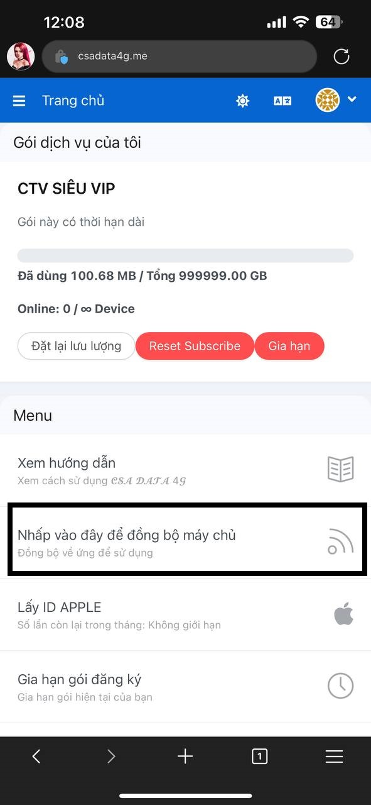
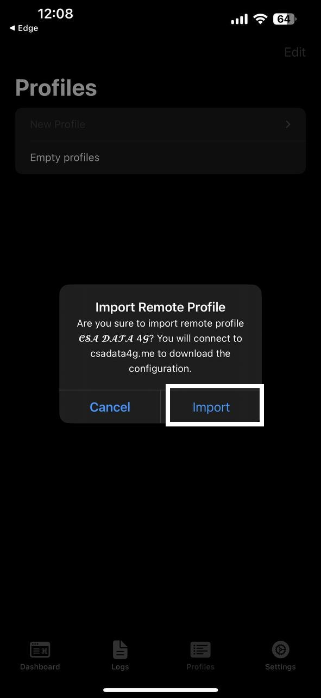

# ĐĂNG KÝ TÀI KHOẢN WEBSITE

## Website chính thức: [CSA DATA 4G](https://csadata4g.me/) - [https://csadata4g.me](https://csadata4g.me/)

> Link Đăng Ký Nhanh: [https://csadata4g.me/#/register?code=csadata4g\_xhEM70pq](https://csadata4g.me/#/register?code=csadata4g\_xhEM70pq)

### Bước 1: Truy cập web [https://csadata4g.me](https://csadata4g.me/) , sau đó bấm vào mục "ĐĂNG KÝ"

<figure><figcaption></figcaption></figure>

Hoặc bạn có thể bấm nhanh vào link đăng ký sau:

&#x20;[https://csadata4g.me/#/register?code=csadata4g\_xhEM70pq](https://csadata4g.me/#/register?code=csadata4g\_xhEM70pq)

### Bước 2: Điền thông tin đăng ký

<figure><figcaption>
<em><strong>Code mời sẽ tự động điền nếu bạn đăng ký bằng link mời</strong></em>
</figcaption></figure>

Bước 3: Đăng nhập tài khoản email - mật khẩu để truy cập web [CSA DATA 4G](https://csadata4g.me/)

<figure><figcaption></figcaption></figure>

Sau khi tạo tài khoản thành công, bạn sẽ được tặng gói FREE 10Gb trong vòng 100 Ngày, mỗi tháng vào ngày 1 hằng tháng, bạn sẽ được reset data để có tiếp 10Gb để sử dụng


Bạn có thể mua gói Free hày tại mục [Mua gói dịch vụ](https://csadata4g.me/#/plan) để có gói Free 1 năm, nhận MỖI NGÀY 1Gb DATA

_**Thông tin gói Free**_

* Tên gói: [MEMBER CSA](https://csadata4g.me/#/plan/4)
* Dung lượng: 1Gb MỖI NGÀY
* Thời hạn: 1 Năm
* Hệ thống server: Việt Nam & Quốc Tế
* Cổng dịch vụ: TCP - Vmess/Webstocket
* Giá: 0đ

* Hỗ trợ Thiết Bị: 1 Thiết Bị


Ngoài ra có rất nhiều gói dịch vụ khác, bạn có thể tham khảo!!

## SAU KHI ĐĂNG KÝ XONG, CÁC BẠN QUA BƯỚC 2 [ĐẰNG KÝ NỀN CHO SIM](dang-ky-nen-cho-sim.md)
