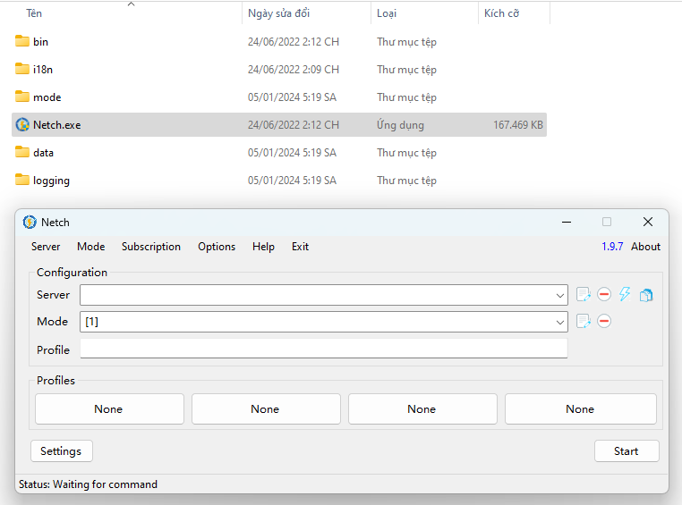

# HƯỚNG DẪN PHÁT WIFI BẰNG PROXY (IOS)



## Bước 1 : Phát dữ liệu cho máy khác&#x20;

<figure><figcaption>
Sau khi phát máy bên kia sẽ kết nối 
</figcaption></figure>

* Tiếp theo ở máy phát wifi hãy vào app **Shadowrocket** như hình sau đây!!

<figure><figcaption>
Hãy ghi nhớ dãy số <strong>IP</strong> và <strong>Cảng</strong>
</figcaption></figure>

## Bước 2 : Máy nhận wifi sẽ kết nối wifi như hình

<figure><figcaption>
Sau khi kết nối nó sẽ hiện ra lỗi bạn hãy bấm hủy và sử dụng không có internet
</figcaption></figure>

<figure><figcaption>
Hoàn tất
</figcaption></figure>

## Bước 3 : Bật VPN CSA

<figure><figcaption>
Máy phát wifi 
</figcaption></figure>

* Sau khi bật ứng dụng lên nó sẽ hiện ra một **thông báo** như vậy tức là bạn đã hoàn tất cách phát wifi mà không cần tải thêm ứng dụng , đến đây bạn có thể sử dụng được rồi


Ưu điểm: **Không cần cài app gì cả**&#x20;

Nhược điểm: **Chỉ lướt web** + **app cơ bản**, không chơi được **Game**.&#x20;

&#x20;                         **Yếu và tốc độ kém**


