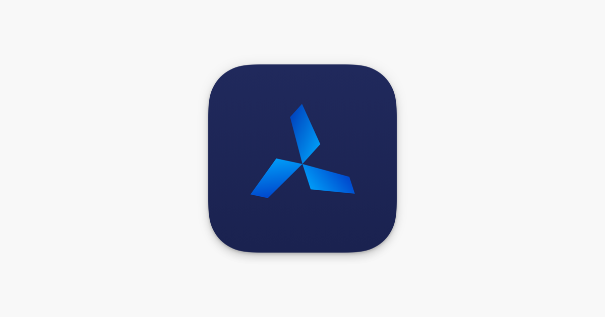
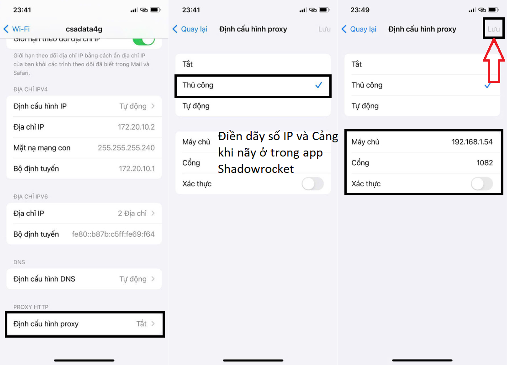
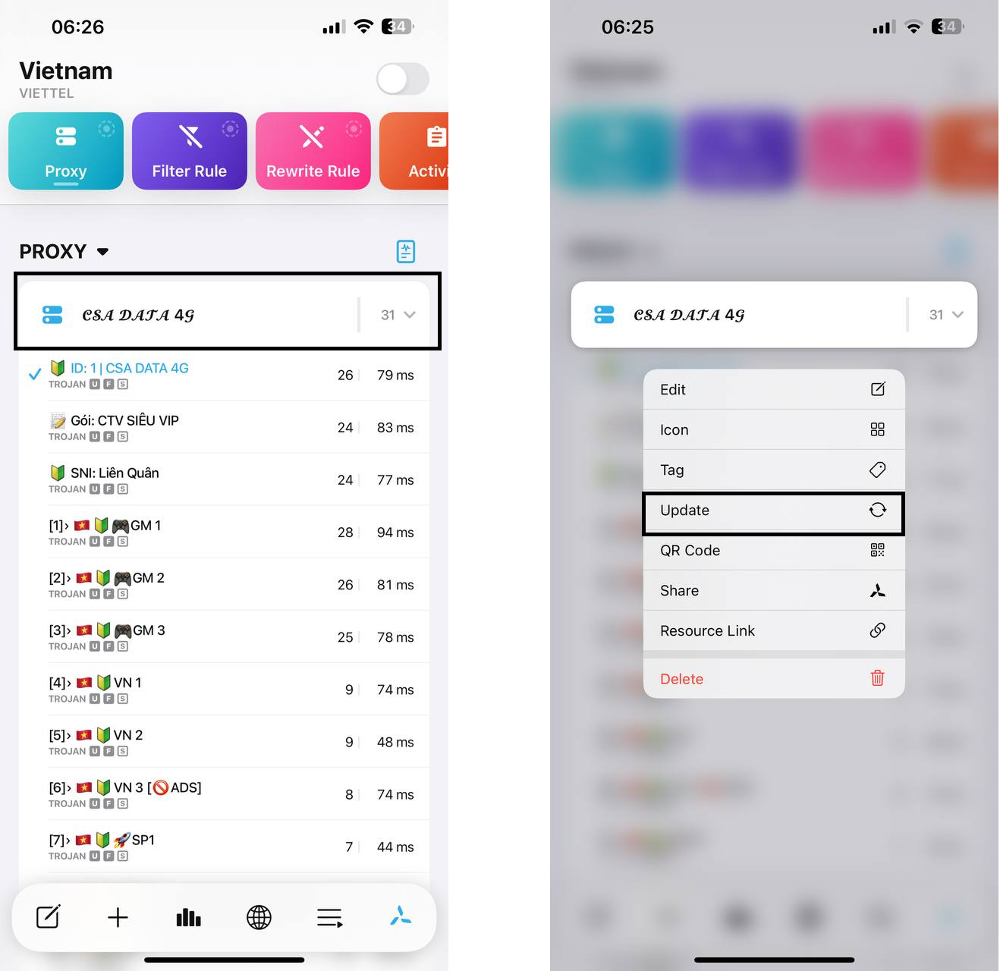
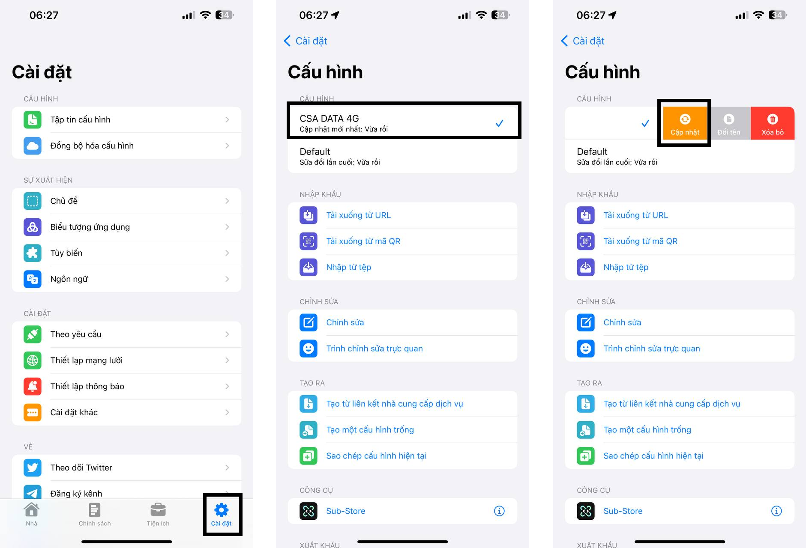
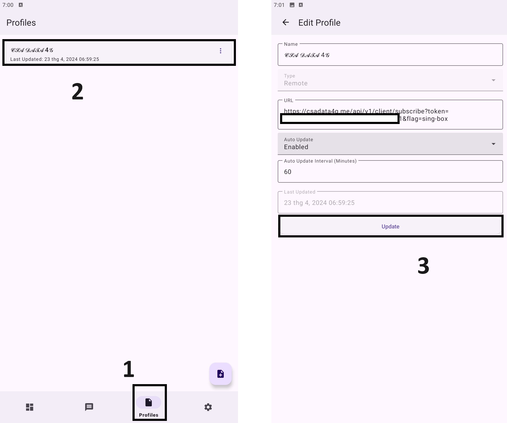
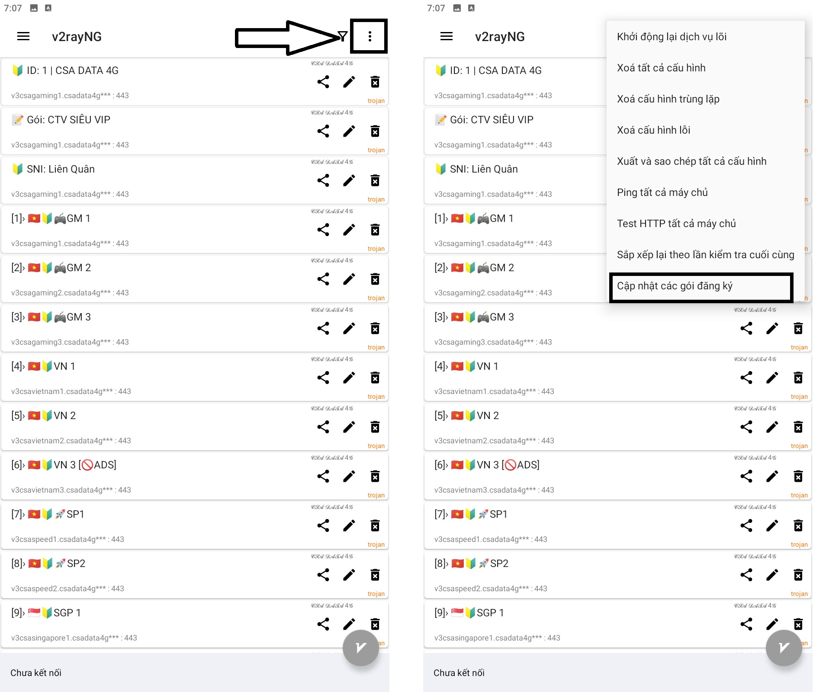
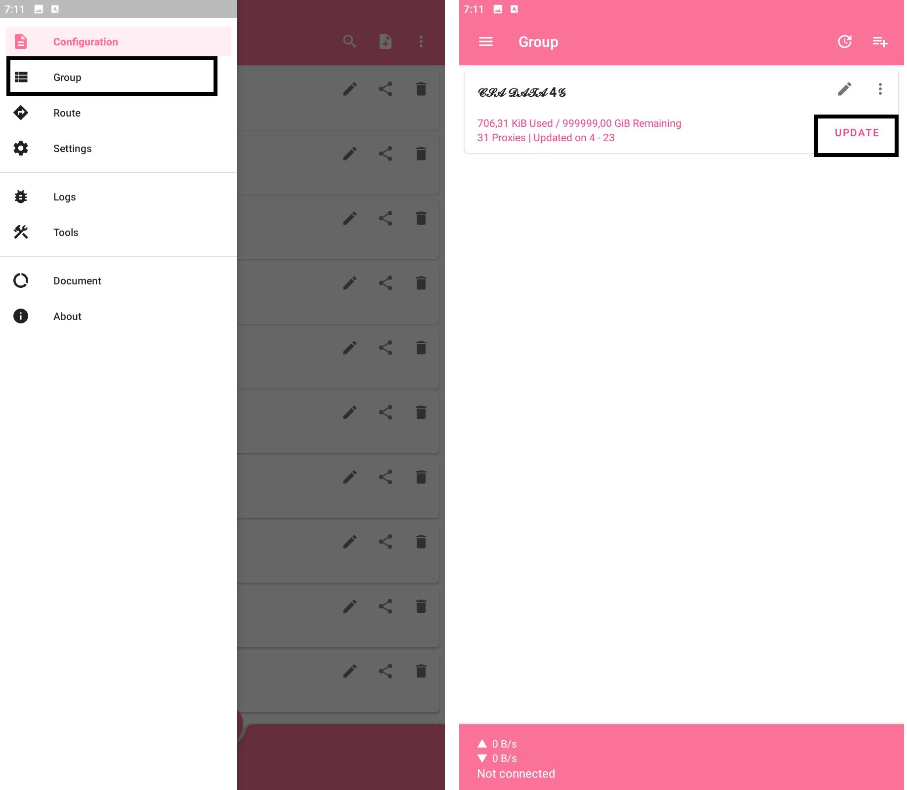
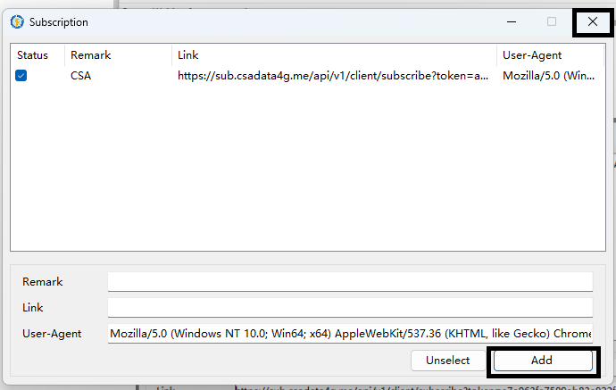

# Hướng dẫn cập nhật Subcribe (Liên kết server)

## CÁCH 1: LÊN TRANG WEB BẤM ĐỒNG BỘ LẠI VỀ APP

Lên [trang chủ web](https://csadata4g.me/#/dashboard) -> tại phần thông tin đã mua gói, bấm đồng bộ lại về app của bạn đang sử dụng

<figure><figcaption>
Với mỗi hệ điều hành, web sẽ đề xuất app phù hợp!
</figcaption></figure>

## CÁCH 2: ĐỒNG BỘ TẠI APP

### Đối với IOS

1. Shadowrocket: Bấm vào biểu tượng 🔃 để cập nhật lại gói đăng ký

<figure><figcaption></figcaption></figure>

2. Singbox: Vào mục Profile -> Bấm vào gói đã đồng bộ -> Update

<figure><figcaption></figcaption></figure>

3. Quantumult X: Nhấn và giữ gói đã đồng bộ -> Hiện bảng thì chọn Update

<figure><figcaption>
Thông thường, Quantumult X sẽ tự cập nhật Sub mỗi khi vào app, nên thường không cần đồng bộ
</figcaption></figure>

4. Stash: Vào cài đặt -> Nhấn và giữ vào gói đăng ký -> Vuốt sang trái để hiện Cập nhật -> Bấm vào đó

<figure><figcaption></figcaption></figure>

### Đối với ANDROID

1. Singbox: Vào mục Profile -> Bấm vào gói đã đồng bộ -> Update

<figure><figcaption></figcaption></figure>

2. V2rayng: Nhấn vào 3 chấm ngay màn hình chính của app -> "Cập nhật các gói đăng ký"

<figure><figcaption></figcaption></figure>

3. NekoBox: Vào mục "Group" -> Bấm "Update"

<figure><figcaption></figcaption></figure>

4. Clash For Android / Clash Meta: Mục Profile -> 3 chấm chỗ gói đăng ký -> Chọn "Update"

<figure><figcaption></figcaption></figure>

