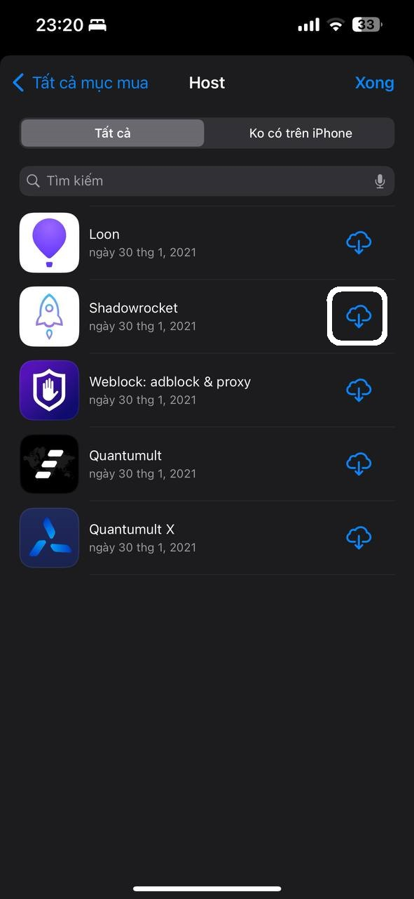
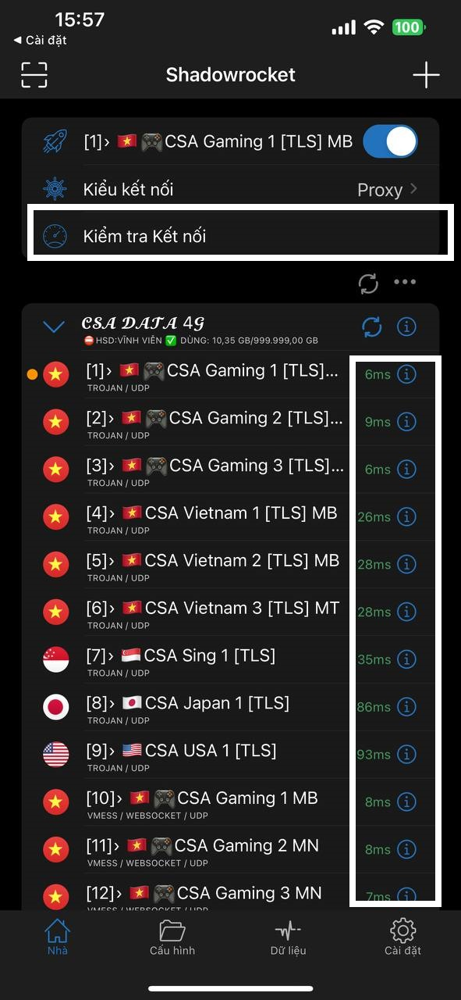
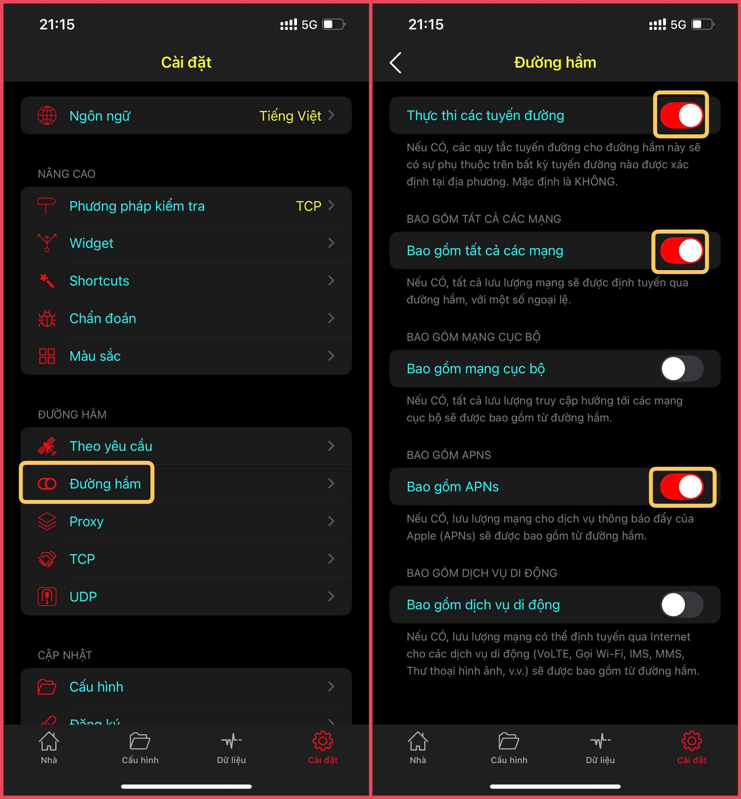

# 🚀 HƯỚNG DẪN ĐỒNG BỘ APP SHADOWROCKET

## CHUẨN BỊ

* Link tải app: [**Shadowrocket** ](https://apps.apple.com/vn/app/shadowrocket/id932747118)_(IOS)_
* Tài khoản web [**DATA CSA 4G**](https://csadata4g.me) _(Bạn có thể đăng ký mới tại_ [_**ĐÂY**_](https://csadata4g.me/#/register?code=csadata4g_xhEM70pq)_)_

## BẮT ĐẦU

1. Lên Web CSA DATA 4G - phần [TRANG CHỦ](https://csadata4g.me/#/dashboard) nhấn **"ĐỒNG BỘ MÁY CHỦ"**

<figure><figcaption></figcaption></figure>

2. Chọn **"CHUYỂN ĐẾN SHADOWROCKET"**

<figure><figcaption></figcaption></figure>

3. Sau khi đồng bộ thành công, bạn vào "**KIỂU KẾT NỐI**"

<figure><figcaption></figcaption></figure>

4. Chọn "**PROXY**"

<figure><figcaption></figcaption></figure>

5. Tiếp theo nhấn vào biểu tượng thông tin tại tên máy chủ

<figure><figcaption></figcaption></figure>

6. Chọn hết 3 mục đang từ "**MẶC ĐỊNH**" thành "**BẬT**". Khi chọn xong nhớ bấm "**Cứu**" (Save) để lưu lại

<figure><figcaption><p>Nhớ bấm lưu vào đấy, không lưu là toang lun đó ;-;</p></figcaption></figure>

7. Sau khi bấm lưu, nó sẽ hiển thị bảng "Cập nhật", bấm vào "**BẬT**"

<figure><figcaption></figcaption></figure>

8. Sử dụng **WIFI** hoặc sim có **MẠNG 4G** bình thường, để bấm **BẬT LẦN ĐẦU TIÊN**, sau đó cấp quyền cài đặt cấu hình **VPN**

<figure><figcaption></figcaption></figure>

9. Sau khi cấp quyền xong, bấm vào **Kiểm Tra Kết Nối** để hiển thị được **TỐC ĐỘ ỔN ĐỊNH** _(Không phải mạnh yếu)_, càng thấp nghĩa là máy bạn kết nối đến server đó càng ổn

<figure><figcaption></figcaption></figure>

## Hướng dẫn bật thông báo cho Shadowrocket

**Vào Cài đặt → Đường hầm**  **Bật dòng 1, dòng 2 và dòng 4 – Vậy là đủ!**


 **Lưu ý:**  **iOS 17 trở lên mới hiển thị đầy đủ các tùy chọn.**

&#x20; **Không đảm bảo 100% thông báo ổn định – Nếu lỗi, hãy bật chế độ máy bay hoặc khởi động lại thiết bị để tối ưu.**


<figure><figcaption></figcaption></figure>

## CHÚ Ý

* MS càng thấp nghĩa là Bạn Kết Nối đến Server đó càng Nhanh, nó không tượng trưng cho việc server đó có yếu hay không
* Kiểm tra kết nối chỉ hoạt động SIM bạn có thể vào mạng bình thường, sim bạn không vào được mạng thì không thể kết nối được đến Server, khiến cho nó ko về Ping
* Muốn kiểm tra Server đã sập hay không thì lên web mục **"**[**TRẠNG THÁI MÁY CHỦ**](https://csadata4g.me/#/node)**"** - Hoặc tại [_**ĐÂY**_](https://csadata4g.me/#/node)

#### 1 Số tùy chỉnh hay cho Shadowrocket

1. **Cài đặt -> Cho phép Phát hiện Bảng tạm -> Tắt**: Nó sẽ giúp cho Shadowrocket không tự ý kiểm tra mục sao chép của bạn và hiển thị bảng có muốn "Dán" vào Shadowrocket hay không
2. **Cài đặt -> Theo yêu cầu -> Quy Tắc Theo Yêu Cầu -> Kết nối: Di Động + Ngắt Kết Nối: Wifi**. Sau đó bật mục "**THEO YÊU CẦU**" lên. Nó sẽ giúp tự động bật kết nối khi sử dụng 4G, và tự động tắt khi kết nối Wifi

```
------------------------------------------------------------
```
