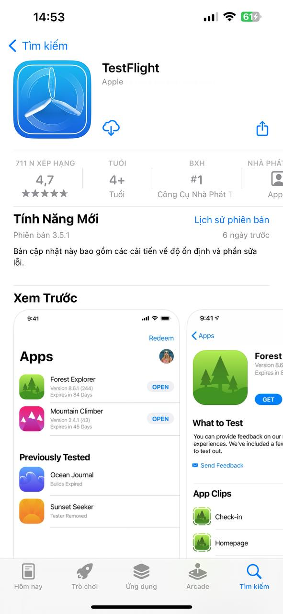
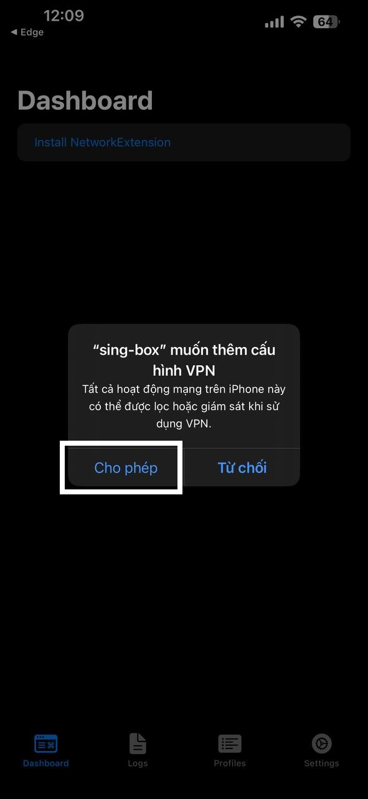
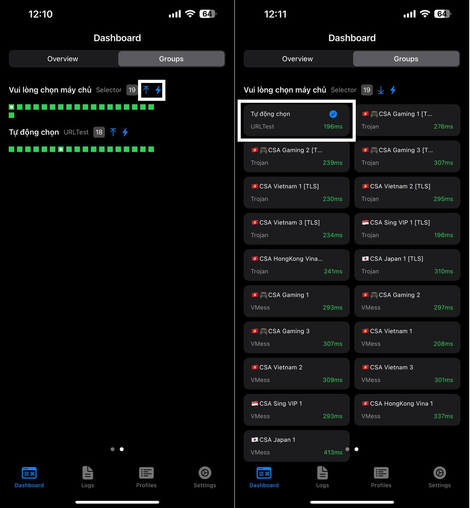

# 📦 HƯỚNG DẪN ĐỒNG BỘ APP SING-BOX

## CHUẨN BỊ

* Link tải app: [**Sing-box**](https://apps.apple.com/vn/app/sing-box/id6451272673) _(IOS - FREE)_
* Tài khoản web [**DATA CSA 4G**](https://csadata4g.me) _(Bạn có thể đăng ký mới tại_ [_**ĐÂY**_](https://csadata4g.me/#/register?code=csadata4g\_xhEM70pq)_)_

## BẮT ĐẦU

1. Lên Web CSA DATA 4G - phần [TRANG CHỦ](https://csadata4g.me/#/dashboard) nhấn **"ĐỒNG BỘ MÁY CHỦ"**

<figure><figcaption></figcaption></figure>


2. Chọn **"CHUYỂN ĐẾN SING-BOX"**

<figure><figcaption></figcaption></figure>

3. Trình duyệt sẽ hiển thị cho phép chuyển qua app Singbox, bạn cho phép để mở app. Sau đó chọn **"IMPORT"**

<figure><figcaption></figcaption></figure>

4. Tiếp tục bấm **"CREATE"**

<figure><figcaption></figcaption></figure>

5. Sau khi **CREATE** xong nó sẽ ra 1 **Profile CSA**, anh em chuyển qua phần **Dashboard**, chọn **Install Network**

<figure><figcaption></figcaption></figure>

6. Chọn **Cho Phép** và **cài đặt VPN**

<figure><figcaption></figcaption></figure>

7. Sau khi cài xong VPN, nó sẽ ra **Profile** ngay **Dashboard**. Chọn bật lên và chọn qua **GLOBAL**

<figure><figcaption></figcaption></figure>

8. Chuyển qua phần GROUP để chọn SERVER. Bấm vào mũi tên để hiển thị danh sách SERVER. Bấm vào tia sét để Ping server

<figure><figcaption></figcaption></figure>


### CHÚ Ý

* Nút "_**TỰ ĐỘNG CHỌN**_" của Singbox sẽ tự chọn server **Ping thấp nhất** cho anh em
* Anh em có thể chọn server mặc định bình thường
* Singbox chặn _**SPEEDTEST**_ nên anh em chọn xong sử dụng như bình thường

```
------------------------------------------------------------
```
