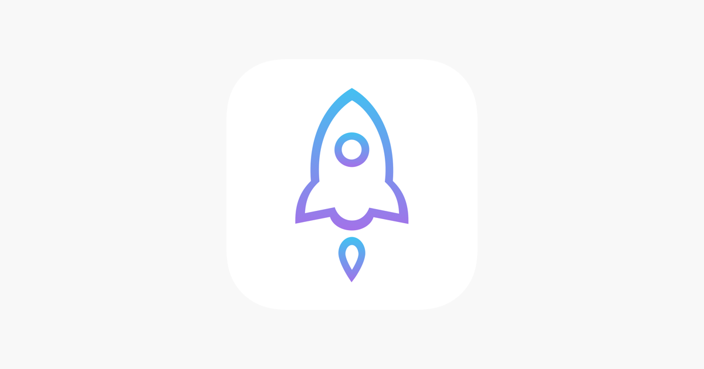

# HƯỚNG DẪN TẢI VÀ ĐỒNG BỘ APP STASH

## NHỮNG ĐIỀU BẠN CẦN BIẾT TRƯỚC KHI SỬ DỤNG STASH

1. [Stash](https://apps.apple.com/vn/app/stash-rule-based-proxy/id1596063349) là ứng dụng tính theo slot thiết bị, sẽ hoạt động tốt nhất nếu anh em **TỰ MUA APP**
2. Stash là app thứ 2 sau Surge (1tr299k) có thông báo, và cáo giao diện đẹp và trực quan hơn Shadowrocket.
3. Trường hợp ID Apple bị phá, vui lòng báo cho admin hoặc tại nhóm hỗ trợ để được hỗ trợ lại


[Tham gia các nhóm hỗ trợ để có thể hỗ trợ và trao đổi tốt hơn](https://app.gitbook.com/s/r51Lh5ll8tiyAjNQhybK/)


***

## I. TRUY CẬP APPSTORE VÀ TÌM KIẾM "[STASH](https://apps.apple.com/vn/app/stash-rule-based-proxy/id1596063349)"

1. Mua app Stash trên Appstore với giá 99k:

<figure><figcaption></figcaption></figure>

## II. CÀI ĐẶT APP STASH

1. Vào mục **CÀI ĐẶT** -> **THIẾT LẬP MẠNG LƯỚI**

<figure><figcaption></figcaption></figure>

2. Chỉnh cài đặt y như hình bên dưới

<figure><figcaption></figcaption></figure>

* Ngắt kết nối
* Bao gồm tất cả mạng
* Bao gồm APNs
* Happy Eyeballs Dual Stack
* Tên miền Sniff

3. Quay lại Nhà (Home) và ấn **BẮT ĐẦU**, sau đó bật **MITM**

<figure><figcaption></figcaption></figure>

3. Bấm cài đặt chứng chỉ

Nên để trình duyệt mặc định là Safari để đảm bảo được cài được nhé

<figure><figcaption></figcaption></figure>

5. Vào mục "Giới thiệu" của máy (Cài đặt -> Cài đặt chung -> Giới thiệu), sau đó kéo xuống dưới mục "Cài đặt chứng chỉ tin cậy" thì bật lên

<figure><figcaption></figcaption></figure>

6. Quay lại stash mà thấy hiện máy được tin cầy là được

<figure><figcaption></figcaption></figure>

## III. ĐỒNG BỘ VÀ BẬT STASH

1. Tải Config mẫu về Stash:

**Link Config:** `https://raw.githubusercontent.com/yuichydev/Apple/refs/heads/master/Stash_CSA4G.yaml`

<figure><figcaption></figcaption></figure>

2. Quay lại mục Nhà (Home) bấm BẮT ĐẦU, và cấp quyền VPN

<figure><figcaption></figcaption></figure>

3. Chuyển **Chế độ gửi đi** -> **Chế độ quy tắc**

<figure><figcaption><p>Chế độ quy tắc</p></figcaption></figure>

3. Truy cập [**Trang Chủ**](https://csadata4g.me/#/dashboard), ấn **Sao Chép Liên Kết Server**

<figure><figcaption></figcaption></figure>

4. Dán link sub vừa copy vào Config mẫu:

<figure><figcaption></figcaption></figure>

5. Ấn **BẮT ĐẦU** và chọn mục **Chính sách**:

* **Lưu ý: Dùng wifi hoặc 4G có data để đồng bộ lần đầu**

<figure><figcaption></figcaption></figure>

6. Kéo xuống và tận hưởng kết quả:

<figure><figcaption><p>Nếu ai dùng wifi phát nền thì mục đầu tiên chọn Auto Select nhé &#x3C;3</p></figcaption></figure>

## IV. CÁCH LẤY STASH CHO BẠN NÀO TỰ MUA APP

1. Tải app Stash từ Appstore về

<figure><figcaption></figcaption></figure>

2. Vào app Stash, chọn mục Cài đặt -> Cài đặt khác -> mục Testflight nhập mail ID Apple của bạn vào và bấm áp dụng

<figure><figcaption></figcaption></figure>

3. Đợi 1 lúc sẽ có mail báo về cho bạn, bạn chỉ việc bấm "View on Testflight là được, sau đó cài đặt như [HƯỚNG DẪN II](./#ii.-cai-dat-app-stash)

<figure><figcaption></figcaption></figure>

## V. 1 SỐ LỖI KHI SỬ DỤNG STASH

1. Lỗi "Thông tin đăng nhập kích hoạt Stash không hợp lệ"

<figure><figcaption></figcaption></figure>

Bạn vào phần TestFlight -> Icon đăng nhập phía góc trên

<figure><figcaption></figcaption></figure>

Chọn Edit -> Remove các máy khác

<figure><figcaption></figcaption></figure>

Sau khi gỡ các thiết bị khác, hãy xóa App và cài lại từ đầu

2. Lỗi không hiện thông báo

Bật tắt Bao gồm APNs 2 - 3 lần, là xong.\
Chúc các bạn thành công!!!

```
----------------------------
```
