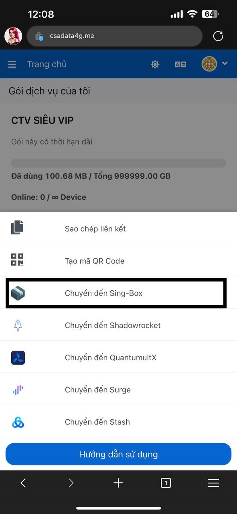

# ⚛️ HƯỚNG DẪN SỬ DỤNG ID APPLE TẢI APP QUANTUMULT X (IOS)

## CHUẨN BỊ

* [ID APPLE](https://csadata4g.me/#/dashboard) tải app [Quantumult X](https://apps.apple.com/vn/app/quantumult-x/id1443988620)
* [Tài khoản Web đã mua gói CSA DATA 4G](https://csadata4g.me/#/plan) (Kể cả gói MEMBER CSA FREE CŨNG LẤY ĐƯỢC ID APPLE)

## BẮT ĐẦU

* Bước 1: Tại phần [TRANG CHỦ](https://csadata4g.me/#/dashboard) chọn mục "LẤY ID APPLE"

<figure><figcaption></figcaption></figure>

* Bước 2: Trang sẽ chuyển qua phần ID Apple, bạn chỉ cần nhấn vào nút "**COPY USERNAME**" _để tự động sao chép tài khoản_ và nút "**COPY PASSWORD**" _để tự động sao chép mật khẩu_

<figure><figcaption><p>ID APPLE SẼ RESET PASS HẰNG NGÀY, NÊN PASS TRÊN ẢNH LÀ SAI!!</p></figcaption></figure>

* Bước 3: Truy cập vào Apptore ngoài màn hình chính - Tuyệt đối không đăng nhập tại mục cài đặt nếu bạn không biết sử dụng Iphone

<figure><figcaption></figcaption></figure>

* Bước 4: Đăng nhập tài khoản - mật khẩu ID Apple bạn lấy được vào **Appstore**

<figure><figcaption></figcaption></figure>

* Bước 5: Sau khi đăng nhập thành công, bạn vào mục "**ĐÃ MUA / PURCHASED**", sau đó vào mục "**MUA HÀNG GIA ĐÌNH / FAMILY PURCHASE**"

<figure><figcaption></figcaption></figure>

* Bước 6: Bạn nhấn vào biểu tượng "**ĐÁM MÂY**" để tải về

<figure><figcaption><p>CHỈ ẤN VÀO ĐÁM MÂY, KHÔNG ẤN VÀO APP!!</p></figcaption></figure>

* Bước 7: Sau khi tải Quantumult X về, vào app sẽ thấy dòng "BUILD" bị màu đỏ, do app limit thiết bị sử dụng. Bạn hãy xóa nó đi

<figure><figcaption><p>Bên cạnh nút bật là dòng build bị đỏ</p></figcaption></figure>

* Bước 8: Quay lại web và bấm vào ô tải app Quanx, chấp nhận cài đặt cho app

<figure><figcaption></figcaption></figure>

* Bước 9: Vào app Quantumult X kiểm tra xem đã mất dòng "BUILD" màu đỏ kia chưa

<figure><figcaption><p>Nút bật đã mất dòng chữ build đỏ</p></figcaption></figure>

### CHÚ Ý

* **NẾU GẶP LỖI "ỨNG DỤNG BỊ VĂNG"**: Xóa ứng dụng bị lỗi, quay lại **Bước 5**, bạn vào mục "**MUA HÀNG CỦA TÔI**", sau đó tải bất kỳ 1 ứng dụng bất kỳ tại đó, mở app lên tầm 5s. Sau đó bạn tải tiếp app **QUANTUMULT X** ở mục "**MUA HÀNG GIA ĐÌNH**" và tiếp tục làm đến **Bước 10**. Sau khi xong tất cả có thể xóa app mồi đi
* **NẾU GẶP LỖI ID KHÔNG THỂ ĐĂNG NHẬP / SAI PASS / BỊ KHÓA....**: Liên hệ Admin để xử lý. Vì các lỗi này là do ý thức người sử dụng phá hoại!!

```
-----------------------------------------
```
