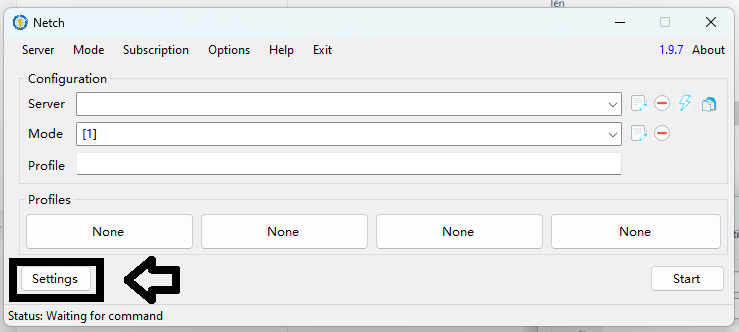
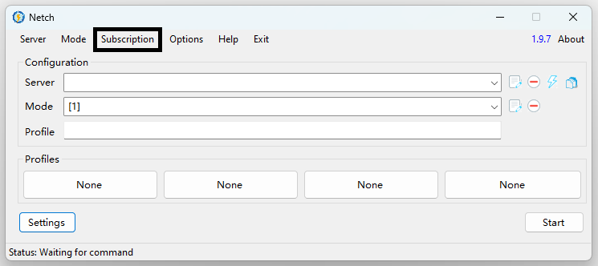

# 💻 HƯỚNG DẪN SỬ DỤNG TRÊN WINDOWS



Về cơ bản để sử dụng trên PC có 2 cường độ

1. Sử dụng chỉ để lướt web: Thì chỉ cần phát wifi qua Proxy, máy nhận là được
2. Sử dụng để Tác Vụ Ứng Dụng + Chơi Game: Cần sử dụng ứng dụng để nhận mạng CSA DATA 4G

Cách sử dụng của phát wifi proxy, đang cập nhật.......

## CHUẨN BỊ

* **WIFI** hoặc **MẠNG DATA** sử dụng **BÌNH THƯỜNG** _(KHÔNG PHẢI DATA HACK, LƯU Ý)_
* Ứng dụng [_**NETCH**_](https://github.com/netchx/netch/releases/download/1.9.7/Netch.7z), hoặc [**CLASH FOR WINDOWS**](https://clashforwindows.net/files/Clash.for.Windows.Setup.0.20.39.exe)

## NETCH

*

1. Insert các quá trình tải nó về và giải nén file, ta được như sau

<figure><figcaption></figcaption></figure>

2. Mờ chương trình Netch.exe (nó thường mặc định chạy quyền admin, nên hãy cấp quyền)

<figure><figcaption><p>Khi mở chương trình, file sẽ tự tạo thêm các thư mục để lưu trữ, không cần quan tâm</p></figcaption></figure>

3. VÀO ĐẦU TIÊN LÀ SETTING (LƯU Ý GIÚP MÌNH ĐÚNG THỨ TỰ TỪNG BƯỚC, ĐỪNG LÀM SAU LÊN TRƯỚC LÀ LỖI NGAY)

<figure><figcaption><p>SETTING CHỨ KHÔNG PHẢI OPTION BẠN NHÉ</p></figcaption></figure>

4. Cài y hệt như trong ảnh là chuẩn, đi theo các số thứ tự mình đã để sẵn

<figure><figcaption><p>Nhấp vào ảnh để nhìn rõ hơn</p></figcaption></figure>

5. Vào mục Subscription -> Manage Subscriptions

<figure><figcaption></figcaption></figure>

6. Dán link Sub vào, Remark thì bạn đặt tên tùy chọn

<figure><figcaption></figcaption></figure>

Link Sub được lấy tại [TRANG CHỦ](https://csadata4g.me/#/dashboard) của web, tại mục "**ĐỒNG BỘ MÁY CHỦ**" -> "**SAO CHÉP LIÊN KẾT**"

7. Bấm ADD sau khi cho link vào, bấm X để đóng trang thêm link

<figure><figcaption></figcaption></figure>

8. Tại mục Subscription, chọn Update Servers

<figure><figcaption></figcaption></figure>

9. Mục **Mode**, bạn tìm kiếm và chọn mục **Bypass LAN**

<figure><figcaption></figcaption></figure>

10. Start Netch 1 lần bằng **MẠNG** bình thường, nếu hiện ra NAT và Ping NAT xanh là chuẩn

<figure><figcaption></figcaption></figure>

BẠN ĐÃ XONG CÁC BƯỚC **SETUP NETCH**, BÂY GIỜ BẠN CÓ THỂ **STOP NETCH** ĐI, CHUYỂN QUA WIFI CỦA **SIM ĐÃ ĐĂNG KÝ NỀN**, KẾT NỐI (NÓ SẼ BÁO KHÔNG CÓ MẠNG), THÌ CỨ **START NETCH LẠI** LÀ XONG, KHÔNG CẦN CHỈNH GÌ THÊM

```
------------------------------------
```

## CLASH FOR WINDOWS

* Đang Update.........

```
------------------------------------
```
