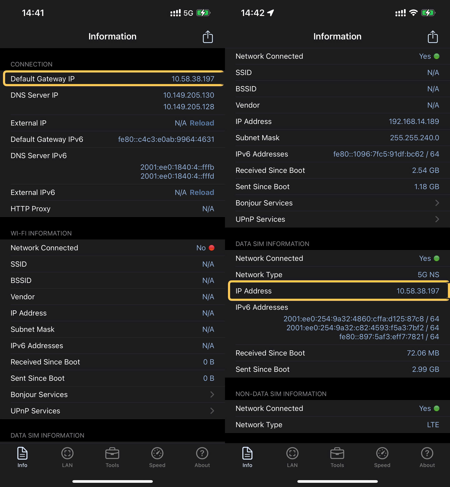

# Bước 2: ĐĂNG KÝ NỀN CHO SIM

## CÁCH ĐĂNG KÝ NỀN


Bạn có thể chọn các nền phù hợp với bạn!

Nên đăng ký gói THÁNG để tối ưu tiền cũng như duy trì ổn định dịch vụ DATA 4G _**(Không có nền không sử dụng được data 4G CSA)**_


### NỀN LIÊN QUÂN

#### Ưu Điểm của nền:

* Mạnh, tốc độ duy trì ổn

#### Nhược Điểm của nền:

* Mỗi ngày chỉ được **1Gb nền Liên Quân,** khi hết nền sẽ bị ngưng data
* Sau 5h sáng sẽ có lại 1Gb data mới


_Ghi chú: Khách hàng khi đăng ký và gia hạn dịch vụ sẽ nhận 1GB Data/ngày/chu kỳ cước._


<table data-full-width="false"><thead><tr><th align="center">Loại gói</th><th align="center">Tên gói</th><th align="center">Cú pháp đăng ký</th><th align="center">Mức giá</th></tr></thead><tbody><tr><td align="center">Gói gia hạn ngày</td><td align="center">Liên Quân Ngày</td><td align="center">LQ1 gửi 9748</td><td align="center">2000đ/ngày</td></tr><tr><td align="center">Gói gia hạn tuần</td><td align="center">Liên Quân Tuần</td><td align="center">LQ7 gửi 9748</td><td align="center">10.000đ/tuần</td></tr><tr><td align="center">Gói gia hạn tháng</td><td align="center">Liên Quân Tháng</td><td align="center">LQ30N gửi 9748</td><td align="center">40.000đ/tháng</td></tr></tbody></table>

### NỀN TIKTOK

#### Ưu điểm của nền:

* Dung lượng thoải mái, tốc độ cao, nên đăng ký gói T15K

#### Nhược điểm của nền:

* Giá cao hơn, duy trì đôi khi không ổn định

| Loại gói          | Cú pháp đăng ký | Cú pháp hủy gia hạn |      Mức giá      |
| ----------------- | :-------------: | :-----------------: | :---------------: |
| Gói gia hạn ngày  |   T5K gửi 191   |    HUY T5K gửi 191  |  5000đ/ngày/15GB  |
| Gói gia hạn tuần  |  T15KN gửi 191  |   HUY T15KN gửi 191 | 15.000đ/tuần/25GB |
| Gói gia hạn tháng |   T50K gửi 191  |   HUY T50K gửi 191  | 50.000đ/tháng/50G |

Nền TikTok còn có thể đăng ký gói T30H - Dạng gói trải nghiệm của T50K

#### HƯỚNG DẪN ĐĂNG KÝ – NHANH, GỌN, DỄ DÀNG - TIKOK T30H

🔹 Bước 1: Gắn SIM Viettel vào máy có 5G, bật mạng di động 📡&#x20;

🔹 Bước 2: Truy cập 👉 hub.vietteltelecom.vn/vx/5g/ 🖥️&#x20;

🔹 Bước 3: Vào Mạng Xã Hội → Chọn Gói TikTok → Nhấn Đăng ký ngay! 🎥&#x20;

🔹 Bước 4: Nhập SĐT Viettel ☎️ → Nhận OTP 🔐 → Xác thực trong 1 nốt nhạc!&#x20;

🔹 Bước 5: Kiểm tra giá 30K, thấy đúng thì bấm OK ngay! 💰&#x20;

🔹 Bước 6: Thanh toán bằng tài khoản SIM hoặc thẻ ngân hàng 💳&#x20;

🔹 Bước 7: Nhận tin nhắn xác nhận, quẩy TikTok không giới hạn! 🚀

<figure><figcaption></figcaption></figure>

***

## CÁCH KIỂM TRA NỀN


Có 2 cách, thông thường kiểm tra cách 1 đôi khi nó sẽ **KHÔNG CHUẨN** - hiển thị nhưng không hoạt động, hãy luôn kiểm tra bằng cách 2 để đảm bảo rằng nền của bạn **THẬT SỰ HOẠT ĐỘNG**


### Cách 1: Tải App My Viettel Hoặc Tra Cứu bằng Tin Nhắn

* Tải app My Viettel tại Appstore và CH play, đăng nhập app và kiểm tra xem nền đã được đăng ký chưa
* Soạn KTTK gửi 191 để kiểm tra dung lượng nền đã đăng ký (Nhớ tắt data sim đi)

<figure><figcaption></figcaption></figure>

### Cách 2: Tải Ứng Dụng để Kiểm Tra

* Với nền **Liên Quân**: Tải app Liên Quân Mobile tại [APPSTORE](https://apps.apple.com/vn/app/garena-li%C3%AAn-qu%C3%A2n-mobile/id1150288115) hoặc tại [CH PLAY](https://play.google.com/store/apps/details?id=com.garena.game.kgvn), sau đó **BẬT 4G** - **TẮT WIFI** - **TẮT VPN**, chỉ cần vào App để xem App có load mạng không (KHÔNG CẦN CHƠI)
* Với nền **TikTok**: Tải app TikTok tại [APPSTORE](https://apps.apple.com/vn/app/tiktok/id1235601864?l=vi) hoặc tại [CH PLAY](https://play.google.com/store/apps/details?id=com.ss.android.ugc.trill), sau đó **BẬT 4G** - **TẮT WIFI** - **TẮT VPN**, chỉ cần vào App để xem App có load mạng không (ĐỌC BÌNH LUẬN 1 VÀI VIDEO)

***

## CÁCH FIX KHI NỀN BỊ LỖI

### Cách 1: **CHECK XEM IP CÓ VÀO DANH SÁCH BỊ BLOCK HAY KHÔNG??**

Đối với trường hợp này, anh em tải app **Net Analyzer** trên **Appstore (IOS)** hoặc **CH Play (ANDROID)**. Sau đó tắt hẳn **WIFI** và bật dữ liệu mạng **4G** của bạn lên. Check kỹ dòng **Default Gateway IP** hoặc **IP Address (DATA SIM INFORMATION)**:&#x20;

<figure><figcaption><p>Net Analyzer</p></figcaption></figure>


**Nếu IP của bạn không thuộc các IP sau đây: 6. (Miền Bắc), 33. (Miền Trung) và 214. (Miền Nam) thì các bạn bật tắt máy bay 2-3 lần để gacha lại khi nào đúng thì dừng nhé!!!**


### Cách 2: Gọi Tổng Đài Hỗ Trợ của Viettel

Call ngay 18008098 - Nhấn phím 5 để gặp trực tiếp hỗ trợ viên (Gọi Không Mất Phí)

```
-----------------------------------------
```
